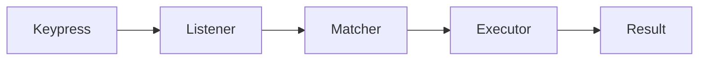

# hotkey-manager ⌨️🚀

  

*One keystroke, one action, zero friction — command your desktop the way it was meant to be commanded.*

  

## 🧭 Overview

Every power user eventually hits the same wall: too many actions, too few fingers, and a keyboard that's only using a fraction of its potential. Windows ships with a handful of rigid shortcuts, and most applications fight over the same combinations, leaving anyone who juggles multiple tools, windows, and workflows stuck reaching for the mouse far more often than they'd like.

**hotkey-manager** exists to close that gap. It is a lightweight, standalone binding engine for Windows 10 and 11 that lets you assign, layer, and orchestrate custom key combinations across your entire system — not just inside a single app. Think of it as a switchboard operator sitting quietly in your system tray, routing every keystroke you define to the exact action you intended, whether that's launching a program, resizing a window, running a script, or chaining a multi-step macro.

This project is built for developers, streamers, accessibility-focused users, and anyone who treats their keyboard as a productivity instrument rather than a typing device. There is no cloud account, no telemetry dashboard, no subscription — just a dependable local tool that stays out of your way until you need it, then responds in milliseconds.

---

## 🔑 What It Actually Does

| Capability | Description |
|---|---|
| **Global Key Binding** | Assign shortcuts that work system-wide, independent of which window or app currently has focus. |
| **Layered Profiles** | Build separate hotkey sets for gaming, design, writing, or admin work, and switch between them without re-mapping anything. |
| **Macro Sequencing** | Chain multiple actions — open app, wait, type text, move window — behind a single keypress. |
| **Conflict Detection** | Automatically flags overlapping bindings before they cause a silent, confusing failure. |
| **Window Choreography** | Snap, resize, minimize, or cycle through windows using combinations you define, not ones Windows imposes on you. |
| **Script & App Launching** | Trigger executables, batch files, or shortcuts instantly, turning a keypress into a full workflow trigger. |
| **Import & Export Profiles** | Move your entire hotkey configuration between machines as a single portable file. |
| **Low-Footprint Background Service** | Runs quietly in the tray with negligible CPU and memory usage, even with dozens of active bindings. |

> [!TIP]
> Start with one profile and five hotkeys. Most users find their "essential set" within the first hour, then expand gradually rather than trying to remap everything on day one.

---

## 🚦 Getting Started

1. **Visit the landing page** — use the download button above to reach the official hotkey-manager page.

2. **Download the installer** — grab the latest standalone build for Windows 10 or 11.

3. **Run it** — no setup wizard maze, no bundled toolbars, just launch and go.

4. **Bind your first hotkey** — open the tray icon, click **New Binding**, press your combination, and choose an action.

> [!NOTE]
> No account creation, no license key, no internet connection required after download. The tool is fully local by design.

---

## 🖥️ System Requirements

| Requirement | Details |
|---|---|
| **Operating System** | Windows 10 (64-bit) or Windows 11 |
| **Dependencies** | None — fully standalone executable |
| **Disk Space** | Under 50 MB |
| **Memory Footprint** | Typically under 40 MB while idle in the tray |
| **Admin Rights** | Only required for bindings targeting elevated applications |

  

---

## ⚙️ How It Works

Under the hood, hotkey-manager behaves like a dispatcher sitting between your keyboard driver and the applications you run. The flow is intentionally simple so it stays fast and predictable:

1. The **listener service** hooks into low-level keyboard events without interfering with normal typing.
2. Incoming key combinations are checked against your **active profile**.
3. A matched combination is resolved into a registered **action** — launch, macro, or window command.
4. The **executor** performs the action and logs the result for troubleshooting if needed.

> [!IMPORTANT]
> The listener runs at a system-wide hook level, which means poorly designed macros with long delays can feel "stuck." Keep sequences short and test them individually before combining.

---

## 🛠️ Troubleshooting

<strong>My hotkey isn't triggering at all.</strong>

Check whether another application has already claimed that combination — hotkey-manager's conflict detector will usually flag this, but system-level reservations from Windows itself can sometimes slip through.

<strong>The action fires twice.</strong>

This typically happens when the same binding exists in two active profiles simultaneously. Review your profile stack and disable the one you're not currently using.

<strong>A macro runs too fast for the target app to keep up.</strong>

Add a short delay step between actions in the macro editor — most timing issues disappear with a 100–200ms buffer.

<strong>Bindings stopped working after a Windows update.</strong>

Restart the background service from the tray icon. Windows updates occasionally reset low-level hook registrations.

<strong>I can't bind a hotkey to an elevated application.</strong>

Run hotkey-manager itself as administrator. Without elevated privileges, it cannot dispatch actions into elevated processes.

> [!WARNING]
> Avoid binding destructive system actions (like shutdown or forced process termination) to easily-triggered single-key combinations. A moment of muscle memory is all it takes.

---

## 🎨 UI / UX Details

hotkey-manager keeps its interface minimal on purpose — a tray-first tool shouldn't demand a full desktop window to feel usable.

- **Themes**: Light, Dark, and an auto mode that follows your Windows theme setting.
- **Shortcut Editor**: Visual capture field — press your combination and it's recorded instantly, no manual typing of key codes.
- **Settings Panel**: Toggle startup behavior, notification style, and profile-switching hotkeys.
- **Tray Indicator**: A subtle icon state change shows which profile is currently active at a glance.

> [!NOTE]
> Keyboard-only navigation is fully supported throughout the settings panel, in keeping with the project's own philosophy.

---

## 🤝 Contributing & Community

Contributions, bug reports, and feature discussions are welcome. Whether you're fixing a matcher edge case, proposing a new action type, or refining documentation, open an issue first so the direction can be discussed before larger changes land.

> Community-driven improvements are what keep a tool like this relevant year after year — every workflow is a little different, and that diversity of use cases makes the project stronger.

---

## 📜 License

Released under the [MIT License](LICENSE), 2026.

---

## ⚠️ Disclaimer

hotkey-manager is provided "as is," without warranty of any kind. Users are responsible for the actions and macros they configure, particularly those affecting system processes, files, or elevated applications. Always test new bindings in a low-stakes context before relying on them in critical workflows.

